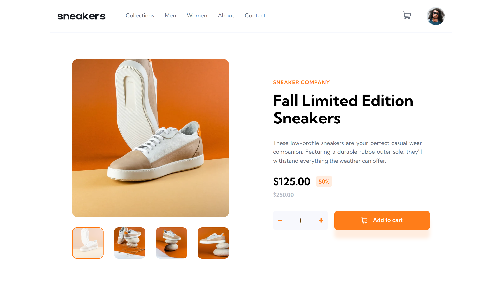
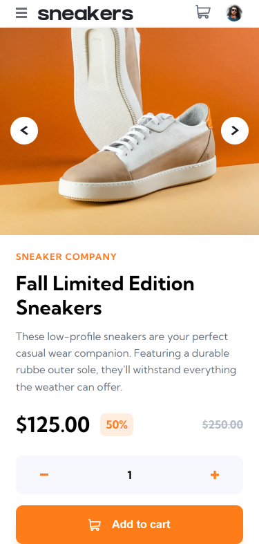

# Frontend Mentor - E-commerce product page

## Solution

  

## The challenge
Users should be able to:
- View the optimal layout for the site depending on their device's screen size
- See hover states for all interactive elements on the page
- Open a lightbox gallery by clicking on the large product image
- Switch the large product image by clicking on the small thumbnail images
- Add items to the cart
- View the cart and remove items from it

## Links
- Solution URL: [https://www.frontendmentor.io/solutions/ecommerce-product-page-onHJyrfruX](https://www.frontendmentor.io/solutions/ecommerce-product-page-onHJyrfruX)
- Live Site URL: [https://e-commerce-1-jec.vercel.app/fall-limited-edition-sneakers](https://e-commerce-1-jec.vercel.app/fall-limited-edition-sneakers)

## Built with
- JavaScript
- TypeScript
- [React](https://reactjs.org/) 
- [Redux Toolkit](https://redux-toolkit.js.org/) 
- [Next.js](https://nextjs.org/) 
- HTML
- CSS